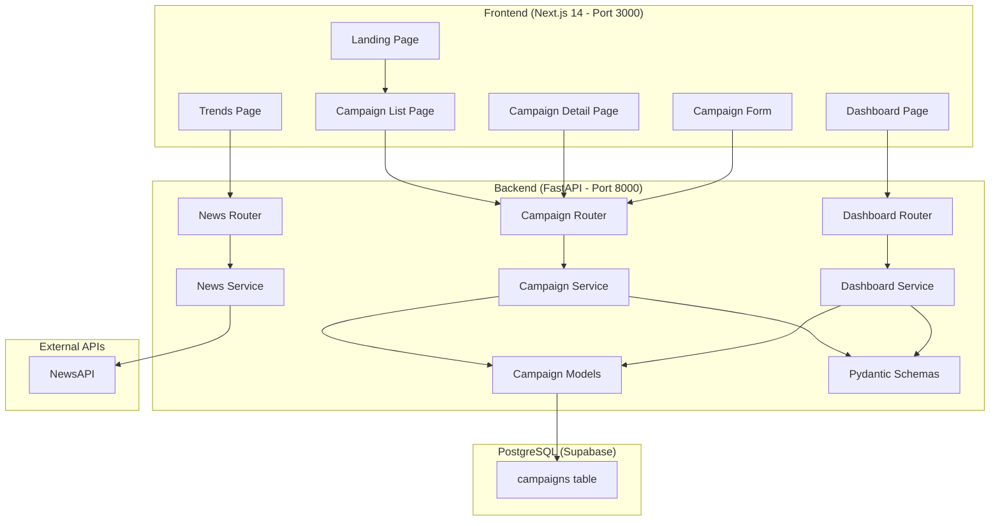
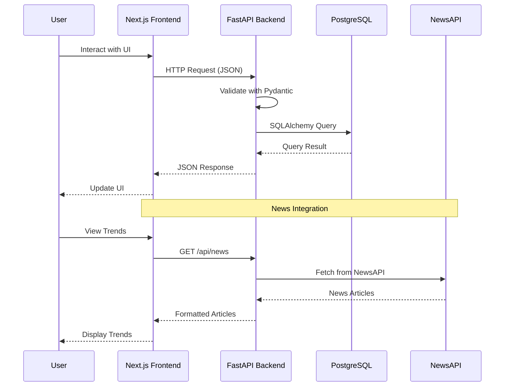

# Design Document: Campaign Tracker

## Overview

Campaign Tracker is a full-stack web application built with a Next.js 14 frontend and FastAPI backend, using PostgreSQL (via Supabase) for persistence. The application enables marketers to manage campaigns through a complete CRUD interface, visualize campaign data through interactive charts, and access trending news via NewsAPI integration. The landing page features smooth animations powered by Framer Motion.

The architecture follows a client-server model with a clear separation between the Next.js frontend (port 3000) and the FastAPI backend (port 8000). The backend exposes RESTful endpoints consumed by the frontend via fetch/axios calls. The database layer uses SQLAlchemy ORM with Pydantic for validation and serialization.

## Architecture



### Request Flow



## Components and Interfaces

### Backend Components

#### 1. FastAPI Application (`backend/app/main.py`)
- Application entry point with CORS middleware configuration
- Mounts routers for campaigns, dashboard, and news
- Database table creation on startup

#### 2. Campaign Router (`backend/app/routers/campaigns.py`)
Endpoints:

| Method | Path | Description | Request Body | Response |
|--------|------|-------------|--------------|----------|
| POST | `/api/campaigns` | Create campaign | `CampaignCreate` | `CampaignResponse` (201) |
| GET | `/api/campaigns` | List campaigns | Query params: `status`, `category`, `sort_by`, `sort_order` | `List[CampaignResponse]` (200) |
| GET | `/api/campaigns/{id}` | Get campaign | - | `CampaignResponse` (200) |
| PUT | `/api/campaigns/{id}` | Update campaign | `CampaignUpdate` | `CampaignResponse` (200) |
| DELETE | `/api/campaigns/{id}` | Delete campaign | - | `{"message": "Campaign deleted"}` (200) |

#### 3. Dashboard Router (`backend/app/routers/dashboard.py`)
Endpoints:

| Method | Path | Description | Response |
|--------|------|-------------|----------|
| GET | `/api/dashboard/summary` | Summary metrics | `DashboardSummary` |
| GET | `/api/dashboard/status-distribution` | Campaigns by status | `List[StatusCount]` |
| GET | `/api/dashboard/budget-by-category` | Budget by category | `List[CategoryBudget]` |
| GET | `/api/dashboard/campaigns-over-time` | Campaign creation trend | `List[TimeSeriesPoint]` |

#### 4. News Router (`backend/app/routers/news.py`)
Endpoints:

| Method | Path | Description | Query Params | Response |
|--------|------|-------------|--------------|----------|
| GET | `/api/news` | Fetch trending news | `keyword` (optional) | `List[NewsArticle]` |

#### 5. Campaign Service (`backend/app/services/campaign_service.py`)
- `create_campaign(db, campaign_data) -> Campaign`
- `get_campaigns(db, status, category, sort_by, sort_order) -> List[Campaign]`
- `get_campaign(db, campaign_id) -> Campaign | None`
- `update_campaign(db, campaign_id, campaign_data) -> Campaign | None`
- `delete_campaign(db, campaign_id) -> bool`

#### 6. Dashboard Service (`backend/app/services/dashboard_service.py`)
- `get_summary(db) -> DashboardSummary`
- `get_status_distribution(db) -> List[StatusCount]`
- `get_budget_by_category(db) -> List[CategoryBudget]`
- `get_campaigns_over_time(db) -> List[TimeSeriesPoint]`

#### 7. News Service (`backend/app/services/news_service.py`)
- `fetch_news(keyword: str | None) -> List[NewsArticle]`
- Uses `httpx` to call NewsAPI (`https://newsapi.org/v2/top-headlines` or `/everything`)
- Handles API errors and rate limits gracefully

#### 8. Database Configuration (`backend/app/database.py`)
- SQLAlchemy engine and session factory using Supabase PostgreSQL connection string
- `get_db()` dependency for FastAPI route injection

### Frontend Components

#### 1. Layout and Navigation (`frontend/src/app/layout.tsx`)
- Root layout with Tailwind CSS and Inter font
- Navigation bar with links: Home, Campaigns, Dashboard, Trends

#### 2. Landing Page (`frontend/src/app/page.tsx`)
- Hero section with animated gradient background
- Feature cards with scroll-triggered Framer Motion animations
- CTA button linking to `/campaigns`
- Smooth scroll navigation

#### 3. Campaign List Page (`frontend/src/app/campaigns/page.tsx`)
- Campaign table/card list with status badges
- Filter dropdowns for status and category
- Sort controls for budget and date
- Create campaign button opening form modal
- Empty state when no campaigns exist

#### 4. Campaign Detail Page (`frontend/src/app/campaigns/[id]/page.tsx`)
- Full campaign details display
- Edit and Delete action buttons
- Back navigation to list

#### 5. Campaign Form Component (`frontend/src/components/CampaignForm.tsx`)
- Reusable form for create and edit operations
- Fields: name, description, status (select), budget (number), start_date, end_date, platform (select), category (select)
- Client-side validation matching backend rules
- Submit handler calling API

#### 6. Dashboard Page (`frontend/src/app/dashboard/page.tsx`)
- Summary metric cards (total campaigns, total budget, active count, avg budget)
- Status distribution pie/donut chart (Recharts `PieChart`)
- Budget by category bar chart (Recharts `BarChart`)
- Campaigns over time line chart (Recharts `LineChart`)
- Empty states for each chart when no data

#### 7. Trends Page (`frontend/src/app/trends/page.tsx`)
- Search input for keyword filtering
- News article cards showing title, description, source, date
- Loading and error states
- Fallback message when API is unavailable

#### 8. API Client (`frontend/src/lib/api.ts`)
- Centralized fetch wrapper for backend API calls
- Base URL from environment variable `NEXT_PUBLIC_API_URL`
- Functions: `getCampaigns()`, `getCampaign(id)`, `createCampaign(data)`, `updateCampaign(id, data)`, `deleteCampaign(id)`, `getDashboardSummary()`, `getStatusDistribution()`, `getBudgetByCategory()`, `getCampaignsOverTime()`, `getNews(keyword?)`

## Data Models

### Database Schema (SQLAlchemy)

```python
class Campaign(Base):
    __tablename__ = "campaigns"

    id: Mapped[int] = mapped_column(Integer, primary_key=True, index=True)
    name: Mapped[str] = mapped_column(String(255), nullable=False)
    description: Mapped[str] = mapped_column(Text, nullable=True, default="")
    status: Mapped[str] = mapped_column(String(20), nullable=False, default="draft")
    budget: Mapped[float] = mapped_column(Float, nullable=False, default=0.0)
    start_date: Mapped[date] = mapped_column(Date, nullable=False)
    end_date: Mapped[date] = mapped_column(Date, nullable=False)
    platform: Mapped[str] = mapped_column(String(50), nullable=False, default="other")
    category: Mapped[str] = mapped_column(String(50), nullable=False, default="other")
    created_at: Mapped[datetime] = mapped_column(DateTime, server_default=func.now())
    updated_at: Mapped[datetime] = mapped_column(DateTime, server_default=func.now(), onupdate=func.now())
```

### Pydantic Schemas

```python
class CampaignBase(BaseModel):
    name: str = Field(..., min_length=1, max_length=255)
    description: str = Field(default="", max_length=2000)
    status: Literal["draft", "active", "paused", "completed"] = "draft"
    budget: float = Field(default=0.0, ge=0)
    start_date: date
    end_date: date
    platform: Literal["facebook", "instagram", "twitter", "google", "linkedin", "email", "other"] = "other"
    category: Literal["brand_awareness", "lead_generation", "sales", "engagement", "retention", "other"] = "other"

    @model_validator(mode="after")
    def validate_dates(self):
        if self.end_date < self.start_date:
            raise ValueError("end_date must be on or after start_date")
        return self

class CampaignCreate(CampaignBase):
    pass

class CampaignUpdate(CampaignBase):
    pass

class CampaignResponse(CampaignBase):
    id: int
    created_at: datetime
    updated_at: datetime
    model_config = ConfigDict(from_attributes=True)

class DashboardSummary(BaseModel):
    total_campaigns: int
    total_budget: float
    active_campaigns: int
    average_budget: float

class StatusCount(BaseModel):
    status: str
    count: int

class CategoryBudget(BaseModel):
    category: str
    total_budget: float

class TimeSeriesPoint(BaseModel):
    date: str
    count: int

class NewsArticle(BaseModel):
    title: str
    description: str | None
    source: str
    url: str
    published_at: str
```

### TypeScript Interfaces (Frontend)

```typescript
interface Campaign {
  id: number;
  name: string;
  description: string;
  status: "draft" | "active" | "paused" | "completed";
  budget: number;
  start_date: string;
  end_date: string;
  platform: string;
  category: string;
  created_at: string;
  updated_at: string;
}

interface CampaignFormData {
  name: string;
  description: string;
  status: string;
  budget: number;
  start_date: string;
  end_date: string;
  platform: string;
  category: string;
}

interface DashboardSummary {
  total_campaigns: number;
  total_budget: number;
  active_campaigns: number;
  average_budget: number;
}

interface NewsArticle {
  title: string;
  description: string | null;
  source: string;
  url: string;
  published_at: string;
}
```


## Correctness Properties

*A property is a characteristic or behavior that should hold true across all valid executions of a system — essentially, a formal statement about what the system should do. Properties serve as the bridge between human-readable specifications and machine-verifiable correctness guarantees.*

### Property 1: Campaign creation round-trip

*For any* valid campaign input data (non-empty name, non-negative budget, end_date >= start_date, valid status/platform/category), creating a campaign via POST and then retrieving it via GET should return a campaign with all the same field values as the input, plus a unique `id`, `created_at`, and `updated_at`.

**Validates: Requirements 1.1**

### Property 2: Invalid campaign input rejection

*For any* campaign input that violates at least one validation rule (empty/missing name, negative budget, end_date before start_date, or status/platform/category not in the allowed set), the Campaign_API should reject the request with a 422 status code and a validation error message, and no campaign record should be created.

**Validates: Requirements 1.2, 1.3, 1.4, 1.5**

### Property 3: Campaign filtering correctness

*For any* set of campaigns in the database and any valid filter (status or category), all campaigns returned by the filtered query should have the matching field value, and no campaign in the database with that field value should be missing from the results.

**Validates: Requirements 2.2, 2.3**

### Property 4: Campaign sorting correctness

*For any* set of campaigns in the database and any valid sort field (budget or start_date) with a sort direction (asc or desc), the returned list should be ordered such that each consecutive pair of campaigns satisfies the sort ordering.

**Validates: Requirements 2.4, 2.5**

### Property 5: Campaign update round-trip

*For any* existing campaign and any valid update data, updating the campaign via PUT and then retrieving it via GET should return a campaign whose fields match the update data, with the same `id` and an `updated_at` timestamp that is >= the previous value.

**Validates: Requirements 3.1**

### Property 6: Non-existent campaign returns 404

*For any* campaign ID that does not exist in the database, GET, PUT, and DELETE operations on `/api/campaigns/{id}` should all return a 404 status code with a descriptive error message.

**Validates: Requirements 3.2, 4.2**

### Property 7: Campaign deletion removes record

*For any* existing campaign, deleting it via DELETE and then attempting to retrieve it via GET should return a 404 status code, and the campaign should not appear in the list returned by GET `/api/campaigns`.

**Validates: Requirements 4.1**

### Property 8: Dashboard aggregation consistency

*For any* set of campaigns in the database:
- The sum of all status distribution counts should equal the total number of campaigns.
- The sum of all budget-by-category totals should equal the total budget across all campaigns.
- The sum of all campaigns-over-time counts should equal the total number of campaigns.
- The summary metrics (total_campaigns, total_budget, active_campaigns, average_budget) should be computable directly from the raw campaign data and match the dashboard endpoint responses.

**Validates: Requirements 5.1, 5.2, 5.3, 5.4**

### Property 9: API response structure consistency

*For any* successful API response from the Campaign_API, the response body should be valid JSON. For any error response (4xx), the response should contain a `detail` field with a descriptive message.

**Validates: Requirements 8.2**

### Property 10: Invalid JSON body returns 422

*For any* request to a POST or PUT campaign endpoint with a body that is not valid JSON or missing required fields, the Campaign_API should return a 422 status code with validation error details.

**Validates: Requirements 8.3**

## Error Handling

### Backend Error Handling

| Error Scenario | HTTP Status | Response Body |
|---|---|---|
| Validation error (Pydantic) | 422 | `{"detail": [{"loc": [...], "msg": "...", "type": "..."}]}` |
| Campaign not found | 404 | `{"detail": "Campaign not found"}` |
| Invalid JSON body | 422 | `{"detail": "Invalid request body"}` |
| NewsAPI unavailable | 502 | `{"detail": "News service temporarily unavailable"}` |
| NewsAPI rate limit | 429 | `{"detail": "News API rate limit exceeded. Please try again later."}` |
| Database connection error | 500 | `{"detail": "Internal server error"}` |
| Unhandled exception | 500 | `{"detail": "Internal server error"}` |

### Backend Error Handling Strategy

- Use FastAPI's built-in exception handlers for `RequestValidationError` (422) and `HTTPException`
- Add a custom exception handler for `NewsAPIError` to map external API failures to appropriate HTTP status codes
- Use a global exception handler to catch unhandled exceptions and return 500 with a generic message (no stack traces in production)
- Log all errors with appropriate severity levels

### Frontend Error Handling

- API client wraps all fetch calls in try/catch and returns structured error objects
- Each page/component handles loading, success, and error states
- Toast notifications for CRUD operation success/failure feedback
- Trends page shows a fallback message when NewsAPI is unavailable
- Form validation errors displayed inline next to the relevant fields

## Testing Strategy

### Testing Framework

- **Backend**: `pytest` with `pytest-asyncio` for async tests, `httpx` for TestClient
- **Property-Based Testing**: `hypothesis` library for Python property-based tests
- **Frontend**: Jest + React Testing Library for component tests (optional)

### Unit Tests

Unit tests cover specific examples, edge cases, and error conditions:

- Campaign creation with valid data returns 201
- Campaign creation with empty name returns 422
- Campaign creation with negative budget returns 422
- Campaign creation with end_date < start_date returns 422
- Campaign update on non-existent ID returns 404
- Campaign delete on non-existent ID returns 404
- Dashboard returns zero metrics when no campaigns exist
- News service returns fallback error when API key is missing

### Property-Based Tests

Property-based tests use the `hypothesis` library to validate universal properties across randomly generated inputs. Each property test runs a minimum of 100 iterations.

Each test is tagged with a comment referencing the design property:

```python
# Feature: campaign-tracker, Property 1: Campaign creation round-trip
# Feature: campaign-tracker, Property 2: Invalid campaign input rejection
# Feature: campaign-tracker, Property 3: Campaign filtering correctness
# Feature: campaign-tracker, Property 4: Campaign sorting correctness
# Feature: campaign-tracker, Property 5: Campaign update round-trip
# Feature: campaign-tracker, Property 6: Non-existent campaign returns 404
# Feature: campaign-tracker, Property 7: Campaign deletion removes record
# Feature: campaign-tracker, Property 8: Dashboard aggregation consistency
# Feature: campaign-tracker, Property 9: API response structure consistency
# Feature: campaign-tracker, Property 10: Invalid JSON body returns 422
```

### Test Organization

```
backend/
  tests/
    conftest.py              # Test fixtures, test database setup
    test_campaign_crud.py    # Unit tests for CRUD operations
    test_campaign_validation.py  # Unit tests for validation edge cases
    test_dashboard.py        # Unit tests for dashboard endpoints
    test_news.py             # Unit tests for news service
    test_properties.py       # Property-based tests for all properties
```

### Test Database Strategy

- Use a separate test PostgreSQL database or SQLite in-memory for tests
- Each test function gets a fresh database session with rollback after test
- Fixtures provide test client and database session
